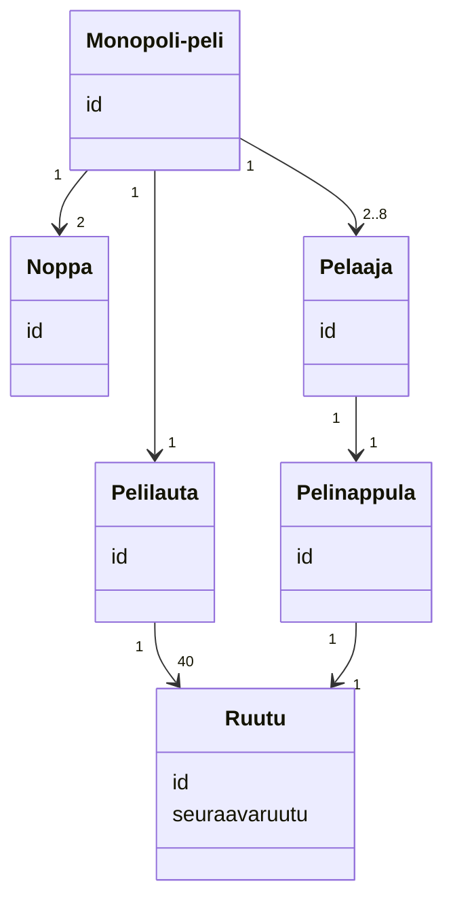

## Sovelluslogiikka Monopoli

```mermaid
 classDiagram
      Monopoli-peli "1" --> "2" Noppa
      Monopoli-peli "1" --> "2..8" Pelaaja
      Monopoli-peli "1" --> "1" Pelilauta
      Pelaaja "1" --> "1" Pelinappula
      Pelilauta "1" --> "40" Ruutu
      Pelinappula "1" --> "1" Ruutu	
      class Monopoli-peli{
          id
          
      }
      class Noppa{
          id
          
      }
	class Pelaaja{
          id
          
          
      }
	class Pelilauta{
          id
          
          
      }
	class Ruutu{
          id
          seuraavaruutu 
          
      }
	 class Pelinappula{
          id
          
          
      }

```
